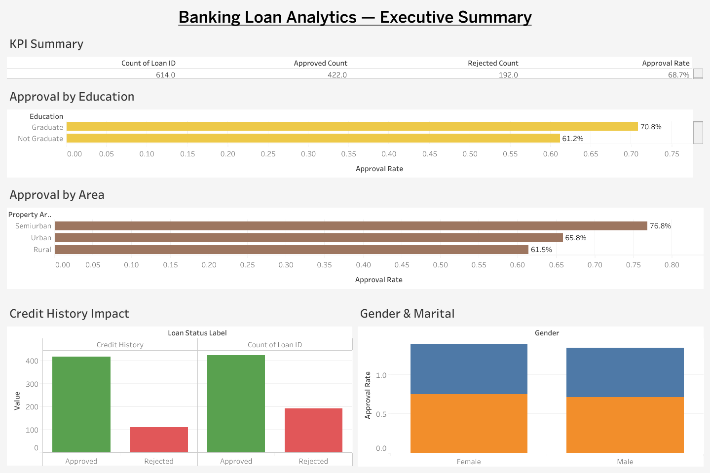
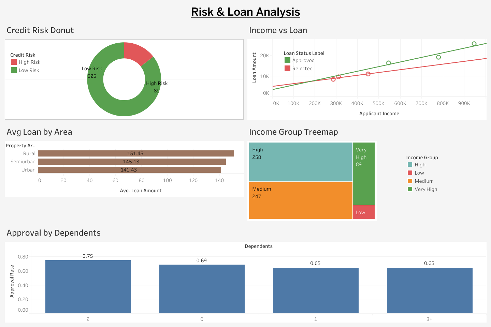
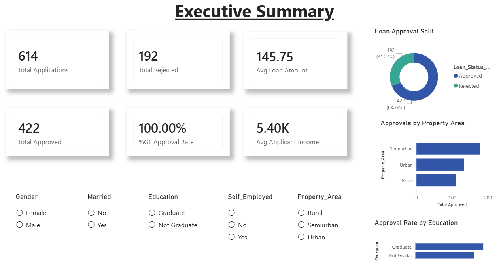

# Banking Customer Analytics & Loan Risk Dashboard

End-to-end banking analytics project analyzing loan approvals and credit 
risk using Excel, PostgreSQL, Python, and Power BI.

## Dashboard Preview

### Tableau Public

[View the interactive Tableau Public dashboard - Executive Summary](https://public.tableau.com/app/profile/arun.pal4087/viz/BankingLoanAnalyticsDashboard/ExecutiveSummary)
[Risk & Loan Analysis](https://public.tableau.com/app/profile/arun.pal4087/viz/Banking_Loan_Tableau_Dashboard/RiskLoanAnalysis)

### Power BI

## Tech Stack
- **Excel** — Data cleaning, missing value treatment, pivot tables, KPIs
- **PostgreSQL** — 10 analytical SQL queries with CTEs and window functions
- **Python** — EDA, correlation analysis, risk segmentation, visualizations
- **Power BI** — 5-page interactive dashboard with 12 DAX measures

## Dataset
Bank Loan Prediction Dataset (Kaggle)
- 614 applicants · 13 features · Real-world loan data

## Key Business Insights
- Overall approval rate: 68.7%
- Good credit history approval: 79.0% vs Bad credit: only 7.9%
- Semiurban properties have highest approval at 76.8%
- High Risk customers have 0% approval rate
- Married applicants approved at 71.8% vs Single at 62.9%
- Rejected applicants requested higher loan amounts (150 vs 144)

## Project Structure
banking-analytics/
├── data/
│ ├── bank_loan.csv
│ └── bank_loan_cleaned.csv
├── sql/
│ └── queries.sql
├── python/
│ ├── load_to_postgres.py
│ └── eda.py
├── outputs/
│ └── (8 EDA charts)
└── Banking_Loan_Dashboard.pbix

## Dashboard Pages
1. **Executive Summary** — 6 KPI cards, approval split, area & education analysis
2. **Customer Analysis** — Gender, marital status, dependents, income group
3. **Loan Analysis** — Loan amounts, terms, income vs loan scatter
4. **Risk Dashboard** — Credit risk distribution, high risk customers, risk by area
5. **Approval Insights** — Approval funnel, gender & marital, dependents impact

## How to Run
1. Download Bank Loan dataset from Kaggle
2. Open `bank_loan.csv` in Excel and perform data cleaning
3. Load to PostgreSQL and run `sql/queries.sql`
4. Run `python python/eda.py` for EDA charts
5. Open `Banking_Loan_Dashboard.pbix` in Power BI Desktop